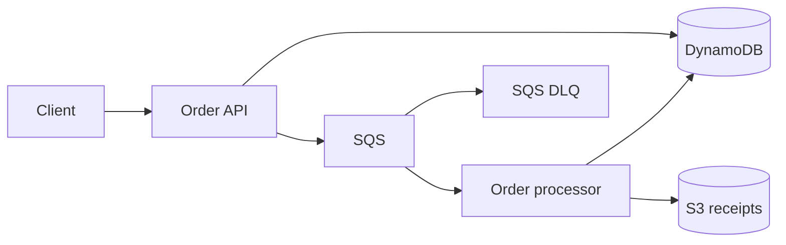
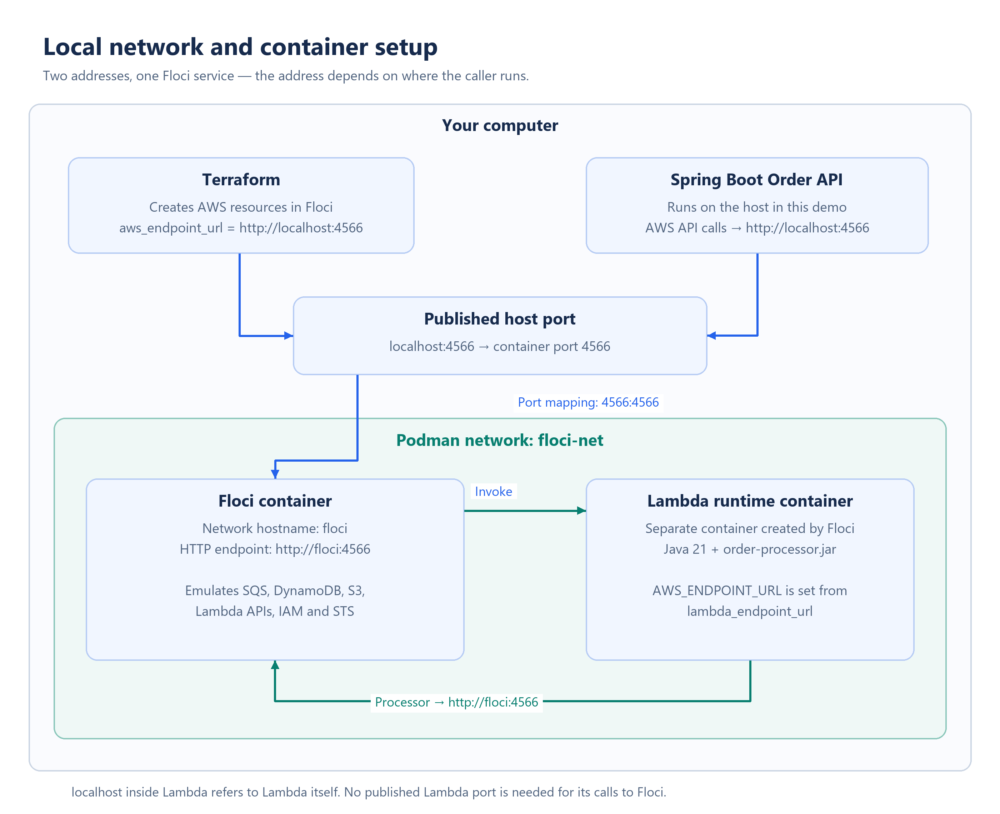
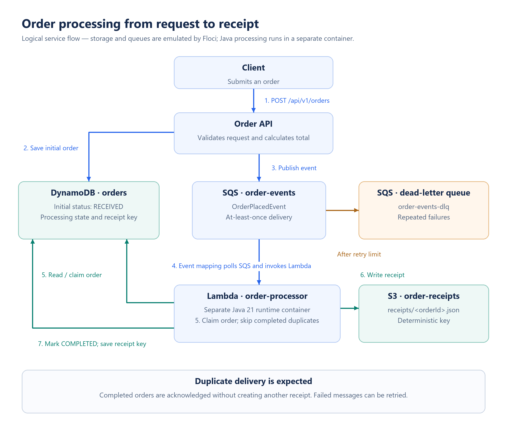

# Architecture

## System flow

Host-side AWS API calls use `http://localhost:4566` in the local profile.
The Lambda runtime container uses `http://floci:4566` on the shared Podman
network. In the AWS profile, SDK clients use standard AWS endpoints and the
default credential provider chain.

## Local container network

For the reasons behind the separate Lambda runtime and the shared service
container, see [Why Floci and Lambda use separate containers](FLOCI_CONTAINERS_EXPLAINED.md).

Floci and the order processor run in separate containers. Floci emulates the
AWS service APIs and uses the mounted Podman socket to create the Java 21
Lambda runtime container. Terraform supplies `order-processor.jar` and its
handler configuration; the processor is not a separately declared Compose
service. Floci manages its runtime container.

`floci-net` is a project-defined Podman network, not an AWS service.
`scripts/start-floci.sh` creates it if missing, and `compose.yaml` declares
the same network and attaches Floci to it.
`FLOCI_SERVICES_LAMBDA_DOCKER_NETWORK=floci-net` tells Floci to attach Lambda
runtime containers to that network too. The network hostname `floci` lets the
processor reach the Floci container directly.

The published mapping `4566:4566` is for host-to-Floci access. The variable
`lambda_endpoint_url` is instead the destination for outgoing AWS API calls
from the processor, passed into its `AWS_ENDPOINT_URL` environment variable.
Publishing a port on Lambda would not change the destination of those calls.
Inside Lambda, `localhost` refers to the Lambda container itself.

## Detailed order processing flow

Both PNGs are 2800 pixels wide with 300 DPI metadata. Their editable source is
`diagrams/render_diagrams.py`; regenerate with Python and Pillow using
`python docs/diagrams/render_diagrams.py` from the repository root.

## Modules

### `shared-domain`

Contains versioned event and value contracts shared by the API and Lambda:

- `OrderPlacedEvent`
- `OrderItem`
- `OrderStatus`
- `Money` conventions
- JSON serialization configuration

The event must include `eventId`, `eventVersion`, `orderId`, `correlationId`,
`occurredAt`, `customerId`, items, currency, and total amount.

### `order-api`

Spring Boot REST application responsible for:

- input validation;
- calculating the server-side total;
- accepting an `Idempotency-Key`;
- saving the initial order state;
- publishing `OrderPlacedEvent` to SQS;
- querying current order state;
- health and readiness endpoints.

Required endpoints:

| Method | Path | Result |
| --- | --- | --- |
| `POST` | `/api/v1/orders` | `202 Accepted` with order ID and status |
| `GET` | `/api/v1/orders/{orderId}` | Current order representation |
| `GET` | `/actuator/health` | Application health |

Use RFC 9457 Problem Details for validation, not-found, conflict, and downstream
dependency errors.

### `order-processor`

Java Lambda consuming `SQSEvent` records. For each record:

1. deserialize and validate the event version;
2. conditionally transition `RECEIVED -> PROCESSING`;
3. if already `COMPLETED`, acknowledge it as a duplicate;
4. write `receipts/<orderId>.json` to S3;
5. transition `PROCESSING -> COMPLETED` and save the receipt key;
6. throw on a retryable failure so SQS can retry it.

Use partial batch failure reporting if supported by the final local integration.
Otherwise use a batch size of one for a deterministic webinar demo and document
the production trade-off.

## AWS resources

Terraform must create:

| Resource | Default name | Important configuration |
| --- | --- | --- |
| DynamoDB table | `orders` | partition key `orderId`, on-demand billing |
| SQS queue | `order-events` | DLQ redrive policy and visibility timeout |
| SQS DLQ | `order-events-dlq` | long message retention |
| S3 bucket | `order-receipts` | private; deterministic receipt key |
| Lambda | `order-processor` | Java runtime, env vars and SQS trigger |
| IAM role/policy | configurable | least privilege for AWS profile |
| Event source mapping | generated | SQS to Lambda; webinar-friendly batch size |

## DynamoDB order shape

Minimum attributes:

| Attribute | Type | Notes |
| --- | --- | --- |
| `orderId` | String | partition key; UUID |
| `idempotencyKey` | String | unique logical request identifier |
| `customerId` | String | required |
| `status` | String | `RECEIVED`, `PROCESSING`, `COMPLETED`, `FAILED` |
| `items` | List | validated snapshot |
| `currency` | String | default `INR` |
| `totalAmount` | Number | calculated server-side |
| `receiptKey` | String | set on completion |
| `correlationId` | String | trace across API, SQS and Lambda |
| `createdAt` | String | ISO-8601 UTC |
| `updatedAt` | String | ISO-8601 UTC |
| `version` | Number | optimistic/conditional update support |

For the demo, implement idempotency with a DynamoDB GSI or a dedicated
idempotency item design. Document the selected design and its concurrency
behaviour.

## Reliability decisions

- SQS delivery is at least once; the consumer must be idempotent.
- Use DynamoDB conditional expressions for state transitions.
- The S3 receipt key is deterministic, preventing duplicate receipt objects.
- Configure a DLQ and a deliberately small retry count for the webinar profile.
- The API's DynamoDB-write/SQS-send sequence is a dual write. Keep the demo
  implementation understandable, but document that a production system should
  use an outbox or another atomic event-publication pattern.

## Configuration boundary

Create strongly typed Spring configuration properties for:

- endpoint URL;
- region;
- table name;
- queue URL/name;
- receipt bucket;
- local fake credentials only.

Do not place endpoint logic in controllers or domain services.
